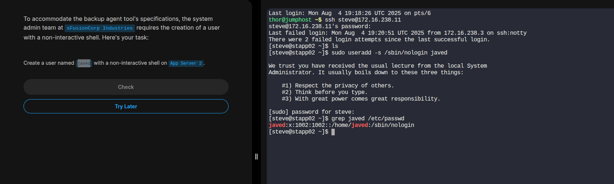

#  Linux Administration

##  How to Create a User with a Non-Interactive Shell on a Linux App Server

---

###  Objective
To create a **system user** who **cannot log in interactively** via SSH or terminal.  
This is commonly done for:
- Service accounts
- Backup agents
- Restricted system users

---

###  Environment
- **Target**: App Server (remote or local Linux machine)

---

###  Procedures

#### 1️⃣ SSH into the App Server

```bash
ssh username@app_server_ip_or_hostname
Replace username and app_server_ip_or_hostname with valid credentials.

```

#### 2️⃣ Create the User with a Non-Interactive Shell
```bash
sudo useradd -s /sbin/nologin john
-s /sbin/nologin: Assigns a shell that prevents login.

```

#### 3️⃣ Verify the User
```bash
grep john /etc/passwd
```
### Expected output:

```bash
john:x:1001:1001::/home/john:/sbin/nologin

```

### 4️⃣ Delete the User (If Needed)

```bash
# Delete only the user
sudo userdel john 

# Delete the user and their home directory:
sudo userdel -r john

```
---
### Example 



---