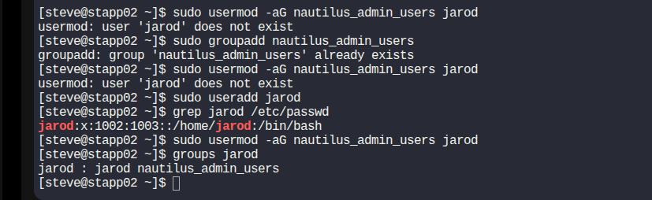
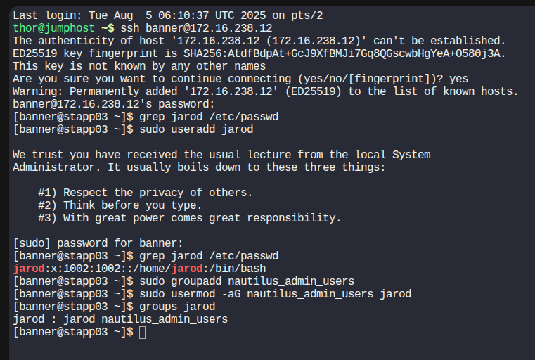

# Create Group Across Multiple Servers and Add User to Group

## Objective
This guide walks you through creating a group and adding a user to that group across multiple Linux servers. 
This is commonly done for centralized permission management in DevOps environments.

---

## Procedure

### 1. SSH into Each Server

```bash
ssh username@server_ip
# Replace username and server_ip with the appropriate values for each server.

```
---

### 2. Create the Group
```bash
sudo groupadd rautilus_admin_users

- Replace rautilus_admin_users with your desired group name.

⚠️ If the group already exists, this command will throw an error — it is safe to ignore.
```
---

### 3. Create the User (if not already created)
```bash
sudo useradd -m -s /bin/bash jarod
```
#### -m creates a home directory

#### -s /bin/bash sets the user’s default shell

```
---
```
### 4. Add the User to the Group
```bash
sudo usermod -aG rautilus_admin_users jarod
```
---

#### -aG appends the user to the group without removing them from existing groups.
```
---
```

### 5. Repeat on All Servers
Perform steps 1–4 on each server where the group and user need to be consistent.

## Example
### App server1

---
### App server2

---
### App server3

---