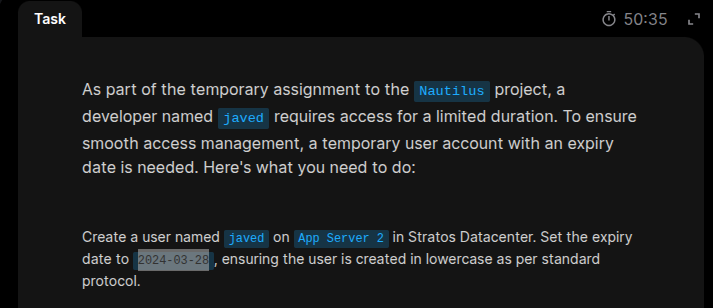
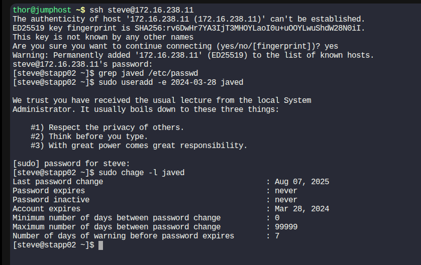

# Temporary User Setup with Expiry

## Objective
### As part of the temporary assignment to the Nautilus project, a developer named ravi requires access for a limited duration. To ensure smooth access management, a temporary user account with an expiry date is needed.

## Task Instructions
### Create a user named ravi on App Server 1 in Stratos Datacenter.
#### - Set the expiry date to 2023-12-07, ensuring the user is created in lowercase as per standard protocol.

## Solution

### - To complete Temporary User Setup with Expiry, you need to create a Linux user that:

#### a. Has a specific expiry date (i.e., the account becomes inactive after a certain date).

#### b. Optionally, has no home directory or specific shell restrictions.

## Procedures
### 1. Create the user with an expiry date
#### Use the useradd command with the -e option to set an expiry date.
```bash
sudo useradd -e 2025-08-10 tempuser
```
#### -e 2025-08-10: sets the account expiry date to August 10, 2025.

##### tempuser: the username.

### NB The date format is YYYY-MM-DD.
---

### 2. Set a password for the user
```bash
sudo passwd tempuser
# You'll be prompted to enter and confirm the password.
```
---

### 3. (Optional) Create user without home directory
#### If you don't want to create a home directory:
```bash
sudo useradd -M -e 2025-08-10 tempuser
```
#### -M: do not create the home directory.
---

### 4. (Optional) Restrict shell access
#### You can prevent the user from logging in by assigning /usr/sbin/nologin or /bin/false as the shell:
```bash
sudo useradd -M -s /usr/sbin/nologin -e 2025-08-10 tempuser
```
---
### 5. Verify the user and expiry
#### Check the user's expiry:

```bash
sudo chage -l tempuser
```
#### You’ll see something like:
Account expires    : Aug 10, 2025

## Example
### Task



---
### Solution



