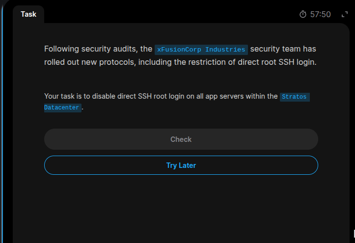
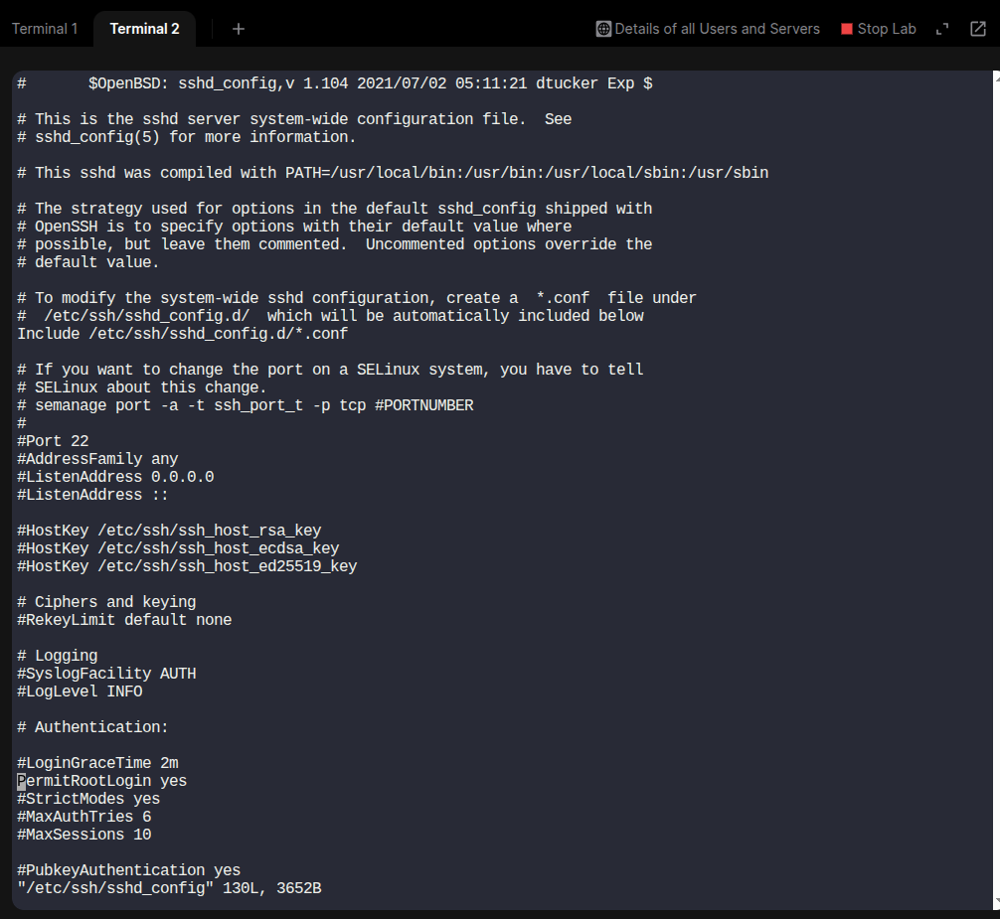
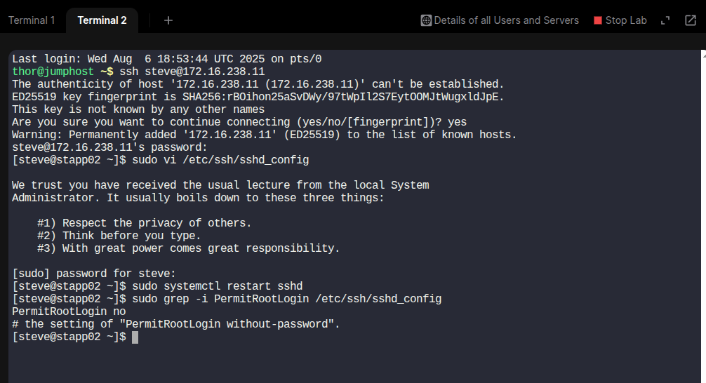

# Secure Root SSH Access
## 1.Disable Server SSH Root Login

#### The root user wields a lot of power and privileges in a Linux environment. One such privilege is logging into a remote server for the root user.

#### You can imagine the security implications of a compromised root user account. The best practice is to disallow the root login and allow login with a user account that has sudo privileges.

#### As such you should disable remote root login to close off this security loophole. Here are the recommended steps of the process:

## Procedures
### 1. Log into the server via the SSH as the root user.

### 2. Open the sshd_config file in your preferred text editor.
```bash
sudo vi /etc/ssh/sshd_config
```
##### If `nano` is not installed ,use vi or vim which are usually pre-installed.
---
### 3. Locate the PermitRootLogin directive. The default value of the directive is YES.

---

### 4. Change this to NO to disable remote root login.
```bash
PermitRootLogin no
```
---
### 5. Due to this change, the root may no longer be able to log in. You should allow another user to log into the server to avoid a complete server lockout. For this, add the following directive to the file:
**AllowUsers** *username*

### 6. Save the changes and exit the editor. DO NOT CLOSE THE TERMINAL.
- Press `Esc`, then type `:wq` and press `Enter`.

### 7. Restart the SSH service with the following command:
```bash
systemctl restart ssh
```
---
### 8. Verify the Configuration.
- After editing and restarting:

```bash
sudo grep -i PermitRootLogin /etc/ssh/sshd_config
```
- Output:
```bash
PermitRootLogin no
```
---
# Example
## Task

---

## SSH config file

---
## Solution

---
# Other Practices to Secure SSH Connections
## 1. Change Default SSH Port (22)
- Reduces exposure to automated attacks.

```bash
sudo vi /etc/ssh/sshd_config
```
- Change:
```bash
Port 2222  # Use any non-standard port
```
- Then restart SSH:
```bash
sudo systemctl restart ssh
```
---
## 2. Use SSH Key Authentication
- More secure than passwords.
```bash
ssh-keygen -t rsa -b 4096
```
```
ssh-copy-id user@your-server
```
## 3. Disable Password Authentication
- Prevents brute-force password attacks.

```bash
sudo vi /etc/ssh/sshd_config
```
- Set
### PasswordAuthentication no
- Restart SSH:

```bash
sudo systemctl restart ssh
```
---
## 4. Restrict SSH Access by IP (using iptables)
- Allows only known IPs to connect via SSH.

```bash
sudo iptables -A INPUT -p tcp -s 1.2.3.4 --dport 22 -j ACCEPT
```
```
sudo iptables-save > /etc/iptables/rules.v4
```
---
## 5. Set SSH Idle Timeout & Connection Limits
- Avoids resource waste and abuse.
### Edit sshd_config:
```bash
ClientAliveInterval 300
ClientAliveCountMax 0
MaxStartups 10:30:100
MaxSessions 2
Restart SSH:
---
```
## 6. Restart the SSH server
```bash
sudo systemctl restart ssh
```
---
## 7. Verify SSH Is Running
- Ensure changes are active.
```bash
systemctl status ssh
```
---
# Conclusion
- Securing SSH access is easy when you follow the right steps. In this guide, we updated the `sshd_config` file to apply key security settings, like using SSH keys instead of passwords.
---

