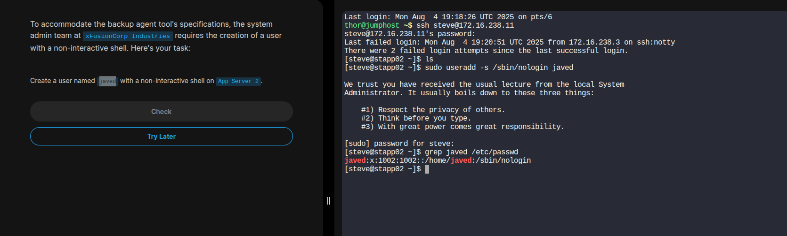

#  Linux Administration

##  How to Create a User with a Non-Interactive Shell on a Linux App Server

---

###  Objective
To create a **system user** who **cannot log in interactively** via SSH or terminal.  
This is commonly done for:
- Service accounts
- Backup agents
- Restricted system users

---

###  Environment
- **Target**: App Server (remote or local Linux machine)

---

###  Procedures

#### 1️⃣ SSH into the App Server

```bash
ssh username@app_server_ip_or_hostname
Replace username and app_server_ip_or_hostname with valid credentials.

```

#### 2️⃣ Create the User with a Non-Interactive Shell
```bash
sudo useradd -s /sbin/nologin john
-s /sbin/nologin: Assigns a shell that prevents login.

```

#### 3️⃣ Verify the User
```bash
grep john /etc/passwd
```
### Expected output:

```bash
john:x:1001:1001::/home/john:/sbin/nologin

```

### 4️⃣ Delete the User (If Needed)

```bash
# Delete only the user
sudo userdel john 

# Delete the user and their home directory:
sudo userdel -r john

```
---
### Example 



---

## How to Set Up a Custom Apache User on a Linux Server with Specific UID and Home Directory
---

### Objective
Configure Apache (HTTPD) to run as a custom non-root user instead of the default user like www-data (Debian/Ubuntu) or apache (CentOS/RHEL).

### Procedure
---
#### 1️⃣ SSH into App Server 1
```bash
ssh tony@stapp01

```
---
#### 2️⃣ Create the User john with UID and Home Directory
```bash
sudo useradd -u 1091 -d /var/www/john -m john

```
```bash
# Assigns user ID
-u 1091: 

# Sets the home directory
-d /var/www/john: 

# Creates the home directory
-m: 
```
---

### Optional
#### Set a non-interactive shell:

```bash
sudo usermod -s /sbin/nologin john
```
---

#### 3️⃣ Verify the User
```bash
id john
grep john /etc/passwd
ls -ld /var/www/john

```

### Example output:
```bash
uid=1091(john) gid=1091(john) groups=1091(john)
john:x:1091:1091::/var/www/john:/sbin/nologin
drwxr-xr-x 2 john john 4096 Aug 5 12:00 /var/www/john

```
---
### Example


---